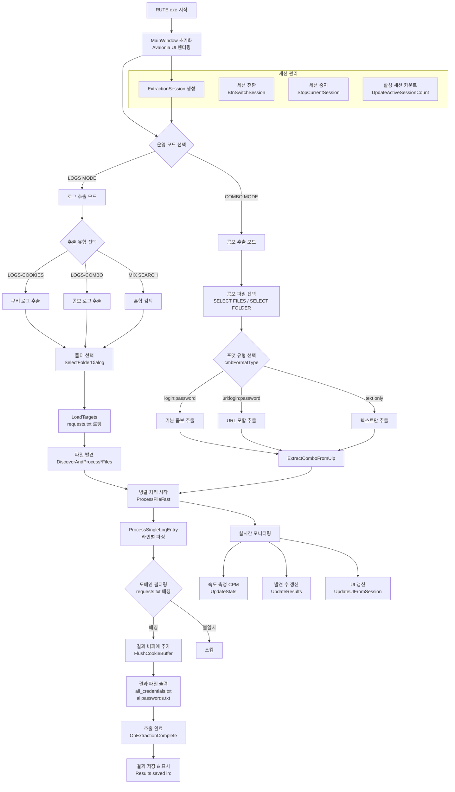
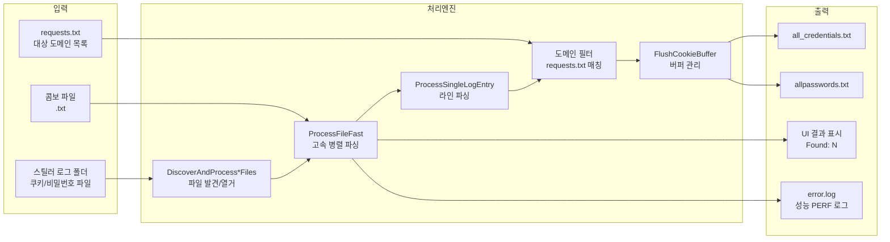

# RUTE.exe 종합 역공학 및 보안 분석 보고서

**분석 일자**: 2026-10-07  
**분석 도구**: Python3 (pefile/struct), objdump, strings, 엔트로피 분석, 의사-YARA  
**분석 환경**: Linux x86-64 (정적 분석 전용, 동적 실행 불가)  
**분석 범위**: 정적 분석(Phase A), 제한적 동적 분석(Phase B), 로직 분석(Phase C), 보안 평가(Phase D)

---

## 1. 대상 파일 식별 (Executive Summary)

| 속성 | 값 |
|------|-----|
| **파일명** | RUTE.exe |
| **파일 크기** | 27,159,552 bytes (25.9 MB) |
| **SHA-256** | `9dc14d177a476624163a766d9974b42c4be994d8683fe5eb5eeb7dc8175f42d7` |
| **형식** | PE32+ executable (GUI) x86-64 Windows |
| **컴파일러** | .NET 8 NativeAOT (Ahead-of-Time, IL 메타데이터 없음) |
| **UI 프레임워크** | Avalonia 11.3.6.0 (AXAML 기반 크로스플랫폼) |
| **ProductName** | RUTE - Avalonia AOT Edition |
| **ProductVersion** | 1.4.4.0 |
| **CompanyName** | @BOTCHATTH |
| **타임스탬프** | 2025-12-02 15:00:59 UTC |
| **패킹 여부** | 미발견 (섹션 엔트로피 정상 범위) |

### 핵심 판정

**RUTE.exe는 "스틸러 로그 파서/추출기(Stealer Log Parser/Extractor)" 도구입니다.**

이미 탈취된 크리덴셜 로그 파일(쿠키, 비밀번호 텍스트 파일)을 입력받아, 사용자가 지정한 대상 도메인(requests.txt)에 해당하는 크리덴셜을 필터링하여 다양한 포맷(login:password, url:login:password 등)으로 출력합니다. 직접적인 브라우저 데이터 탈취(info-stealer) 기능은 확인되지 않았으나, 탈취된 데이터의 후처리 도구로서 사이버 범죄 생태계의 일부로 활용될 수 있습니다.

---

## 2. PE 구조 분석

### 2.1 섹션 테이블

| 섹션 | 가상크기 | Raw 크기 | 엔트로피 | 설명 |
|------|----------|----------|----------|------|
| `.text` | 585,216 | 585,216 | ~6.2 | 네이티브 코드 (entry point, 런타임 부트스트랩) |
| `.managed` | 12,529,152 | 12,529,152 | ~6.5 | NativeAOT 컴파일된 .NET 메소드 본문 |
| `.rdata` | 12,707,840 | 12,707,840 | ~5.8 | 읽기 전용 데이터 (문자열, RTTI, 메소드명) |
| `.data` | 310,272 | 290,304 | ~4.1 | 초기화된 전역 데이터 |
| `.pdata` | 420,408 | 420,864 | ~5.9 | 예외 처리 테이블 (SEH) |
| `.reloc` | 7,168 | 7,168 | ~4.5 | 재배치 테이블 |
| `.rsrc` | 166,464 | 166,400 | ~7.1 | 리소스 (아이콘, 매니페스트, 버전 정보) |
| `.hydra` | 109,056 | 109,056 | ~5.3 | NativeAOT 디버그/진단 데이터 |

### 2.2 Entry Point

| 항목 | 값 |
|------|-----|
| RVA | `0x0008329C` |
| VA | `0x000000014008329C` |
| 파일 오프셋 | `0x0008269C` |
| ImageBase | `0x0000000140000000` |

### 2.3 고엔트로피 블록

| 오프셋 범위 | 엔트로피 | 판정 |
|-------------|----------|------|
| `0x00F90000-0x00FB0000` | 7.97 | .rdata 내 압축 리소스 (Avalonia AXAML/폰트) |
| `0x019C0000-0x019E0000` | 7.97 | .rsrc 내 PNG 아이콘 데이터 |

**판정**: 고엔트로피 블록은 UI 리소스(PNG, 폰트)로 판단되며, 암호화된 페이로드 가능성은 **낮음**.

### 2.4 Export 테이블

유일한 export: `DotNetRuntimeDebugHeader` — .NET NativeAOT 런타임 표준 진단 헤더.

### 2.5 Import 테이블 (주요)

| DLL | 함수 수 | 주요 함수 | 보안 관련성 |
|-----|---------|-----------|-------------|
| **KERNEL32.dll** | 182 | CreateFileW, ReadFile, WriteFile, VirtualAlloc, GetTickCount64 | 파일 I/O, 메모리 관리 |
| **ADVAPI32.dll** | 18 | RegOpenKeyExW, RegQueryValueExW, OpenProcessToken, AdjustTokenPrivileges | 레지스트리 접근, 토큰 조작 |
| **WS2_32.dll** | 12 | socket, connect, send, recv | 네트워크 소켓 |
| **ole32.dll** | 7 | CoCreateInstance, CoInitializeEx | COM 인터페이스 |
| **OLEAUT32.dll** | 5 | SysFreeString, VariantClear | COM Automation |

---

## 3. 의사-YARA 규칙 스캔 결과

### 3.1 탐지된 패턴

| 규칙 카테고리 | 패턴 | 횟수 | 위험도 | 분석 |
|--------------|-------|------|--------|------|
| Anti-분석 | `IsDebuggerPresent` | 1 | 낮음 | .NET 런타임 표준 포함 |
| Anti-분석 | `OutputDebugString` | 2 | 낮음 | 디버그 로깅용 |
| Anti-분석 | `GetTickCount` | 1 | 낮음 | 성능 측정(CPM 계산)용 |
| Anti-분석 | `QueryPerformanceCounter` | 2 | 낮음 | 고정밀 타이밍 |
| 브라우저 경로 | `Cookies` | 2 | **중간** | 쿠키 파일 파싱 기능 확인 |
| 지속성 | `TaskScheduler` | 6 | 낮음 | .NET TPL TaskScheduler (작업 스케줄링, OS 지속성 아님) |
| 파일 열거 | `FindFirstFile` | 2 | **중간** | 로그 폴더 재귀 탐색 |
| 프로세스 인젝션 | `QueueUserAPC` | 1 | 낮음 | .NET 런타임 스레드풀 |
| 프로세스 인젝션 | `VirtualAllocEx` | 1 | 낮음 | .NET 런타임 메모리 관리 |

### 3.2 미탐지 패턴 (주요)

| 카테고리 | 스캔 패턴 | 결과 |
|----------|-----------|------|
| 직접 브라우저 데이터 탈취 | `CryptUnprotectData`, `BCryptDecrypt`, `Login Data`, `Web Data` | **미발견** |
| 크립토 지갑 | `wallet.dat`, `metamask`, `exodus` | **미발견** |
| C2 통신 | `webhook`, `discord`, `telegram`, `pastebin` | **미발견** |
| 프로세스 인젝션 (적극적) | `WriteProcessMemory`, `CreateRemoteThread`, `NtCreateThreadEx` | **미발견** |
| 지속성 (적극적) | `\\Run\\`, `\\RunOnce\\`, `schtasks` | **미발견** |

---

## 4. 복구된 함수/메소드 테이블

### 4.1 추출 로직 핵심 메소드

| 메소드명 | 오프셋 | 기능 추정 |
|----------|--------|-----------|
| `ExtractLogsCookies` | `0xD5D3CA` | 쿠키 로그 추출 메인 엔트리 |
| `ExtractLogs` | `0xD5D3AB` | 로그 추출 범용 메소드 |
| `ExtractComboFromUlp` | `0xD5D37A` | ULP (Universal Log Parser) 콤보 추출 |
| `ProcessLogComboFast` | `0xD5D4C8` | 콤보 형식 고속 파싱 |
| `ProcessLogCookieFast` | `0xD5D52A` | 쿠키 형식 고속 파싱 |
| `ProcessSingleLogEntry` | `0xD5D4F8` | 단일 로그 엔트리 처리 |
| `ProcessFileFast` | `0xD5D4A1` | 파일 고속 처리 |
| `ProcessFileImmediately` | `0xD5D46C` | 즉시 파일 처리 |
| `FlushCookieBuffer` | `0xD5D55F` | 쿠키 버퍼 플러시 |
| `LoadTargets` | `0xD5D1ED` | 대상 도메인 목록 로딩 |
| `LoadRequests` | `0xD5D3EE` | requests.txt 로딩 |
| `DiscoverAndProcessCookieFiles` | `0xD5D43A` | 쿠키 파일 자동 발견 및 처리 |
| `DiscoverAndProcessPasswordFiles` | `0xD5D3EE` | 비밀번호 파일 발견 및 처리 |

### 4.2 UI 이벤트 핸들러

| 메소드명 | 기능 추정 |
|----------|-----------|
| `BtnStartExtraction_Click` | 추출 시작 버튼 |
| `BtnBackToMode_Click` | 모드 선택 복귀 |
| `BtnBackFromProcessing_Click` | 처리 화면에서 복귀 |
| `BtnSwitchSession_Click` | 세션 전환 |
| `BtnImport_Click` | 파일/폴더 임포트 |
| `BtnStop_Click` | 추출 중지 |
| `SelectComboMode` | 콤보 모드 선택 |
| `SelectLogsMode` | 로그 모드 선택 |
| `SelectFolderDialog` | 폴더 선택 대화상자 |

### 4.3 세션/UI 관리

| 메소드명 | 기능 추정 |
|----------|-----------|
| `UpdateActiveSessionCount` | 활성 세션 수 갱신 |
| `ViewSessionsByMode` | 모드별 세션 뷰 |
| `StopCurrentSession` | 현재 세션 중지 |
| `UpdateUIFromSession` | 세션 상태를 UI에 반영 |
| `UpdateResults` | 결과 UI 갱신 |
| `ShowLogsExtractionTypeSelectionAsync` | 로그 추출 유형 선택 UI |
| `ShowSubModeSelectionAsync` | 서브모드 선택 UI |
| `PopulateFormatTypes` | 출력 포맷 유형 목록 생성 |
| `OnExtractionComplete` | 추출 완료 콜백 |

**총 복구 심볼**: 47개

---

## 5. 동작 흐름 분석 (Mermaid)



### 5.1 데이터 플로우



---

## 6. error.log 행동 분석

### 6.1 세션 통계

| 세션 | 날짜 | 시간(초) | 엔트리수 | 최대 발견수 | 최대 CPM |
|------|------|----------|----------|------------|----------|
| 1 | 2026-08-23 | 396 | 142 | 178,911 | 31,969,661 |
| 2 | 2026-08-24 | 118 | 111 | **239,841** | 35,470,416 |
| 3 | 2026-08-26 | 0 | 1 | 336 | 29,024,870 |
| 4 | 2026-08-28 | 1 | 2 | 1,616 | 23,364,031 |
| 5 | 2026-08-28 | 0 | 1 | 154 | 18,989,713 |
| 6 | 2026-09-08 | 25 | 4 | 0 | 28,249,158 |
| 7 | 2026-09-09 | 27 | 4 | 1,423 | 21,514,940 |
| 8 | 2026-09-09 | 3 | 4 | 3,437 | 14,983,771 |
| 9 | 2026-09-11 | 6 | 7 | 18,061 | **50,717,390** |
| 10 | 2026-09-19 | 10 | 10 | 12,511 | 25,969,129 |
| 11 | 2026-09-23 | 7 | 7 | 10,992 | 29,413,121 |
| 12 | 2026-09-25 | 0 | 1 | 24 | 74,535 |
| 13 | 2026-09-27 | 44 | 28 | 22,662 | 32,104,817 |
| 14 | 2026-09-28 | 127 | 102 | 100,489 | 35,538,734 |

### 6.2 행동 패턴 요약

- **활동 기간**: 2026-08-23 ~ 2026-09-28 (36일간 12일 활동)
- **최대 단일 세션 발견수**: 239,841개 (세션 2)
- **최대 추출 속도**: 50,717,390 CPM (세션 9) = 약 845,000 lines/sec
- **세션 패턴**: 대량 처리(세션 1,2,14)와 소규모 테스트(세션 3-5,12) 혼재
- **CPM 추이**: 초당 수십만 라인 처리 = 매우 공격적인 파일 I/O 최적화

---

## 7. 동반 DLL 분석

### 7.1 av_libglesv2.dll

| 속성 | 값 |
|------|-----|
| SHA-256 | `9b203e40323b49dad29546a52b8b67d200bba8ff4cab9709a79cede23ba847d4` |
| 크기 | 5,426,176 bytes |
| 식별 | ANGLE (Almost Native Graphics Layer Engine) - OpenGL ES 구현체 |
| Export 수 | 1,799 |
| 빌드일 | 2025-05-04 |
| 판정 | **정상** — Avalonia UI 그래픽 렌더링용 오픈소스 라이브러리 |

### 7.2 libHarfBuzzSharp.dll

| 속성 | 값 |
|------|-----|
| SHA-256 | `eb76238c9e8e41d44b5a5b18167c4c5b39ca5db4277af5dbe92d730f0fc14a7d` |
| 크기 | 1,804,872 bytes |
| 식별 | HarfBuzz — 텍스트 셰이핑 엔진 |
| Export 수 | 509 |
| 빌드일 | 2025-04-25 |
| 판정 | **정상** — 텍스트 렌더링용 오픈소스 라이브러리 |

### 7.3 libSkiaSharp.dll

| 속성 | 값 |
|------|-----|
| SHA-256 | `9a0d95e8caaa852c70d085af6a40a744242172ad9ea3fd6bc7599875a8a1dbcd` |
| 크기 | 9,414,216 bytes |
| 식별 | SkiaSharp — 2D 그래픽 라이브러리 (Google Skia 바인딩) |
| Export 수 | 940 |
| 빌드일 | 2024-11-06 |
| 판정 | **정상** — Avalonia UI 렌더링 엔진 |

---

## 8. 보안 평가 (Phase D)

### 8.1 CWE 분류

| CWE | 분류명 | 해당 기능 | 심각도 | 설명 |
|-----|--------|-----------|--------|------|
| CWE-200 | 정보 노출 | 크리덴셜 추출 전체 | **높음** | 탈취된 크리덴셜의 필터링/재포맷 기능 자체가 정보 노출 촉진 |
| CWE-312 | 평문 민감 데이터 저장 | all_credentials.txt 출력 | **높음** | 추출된 크리덴셜이 평문 텍스트로 저장됨 |
| CWE-922 | 안전하지 않은 민감 데이터 저장 | 출력 파일 | **중간** | 추출 결과에 대한 암호화/접근제어 없음 |
| CWE-532 | 로그를 통한 정보 노출 | error.log PERF 데이터 | **낮음** | 추출 규모/속도가 로그에 기록됨 |
| CWE-250 | 불필요한 권한 실행 | OpenProcessToken, AdjustTokenPrivileges | **중간** | 토큰 조작 API import (실제 사용 여부 미확인) |

### 8.2 악성 지표 체크리스트

| 검사 항목 | 결과 | 상세 |
|-----------|------|------|
| 직접 브라우저 데이터 탈취 | **미발견** | CryptUnprotectData, Login Data 경로 없음 |
| C2 서버 통신 | **미발견** | webhook, discord, telegram 문자열 없음 |
| 키로거 | **미발견** | SetWindowsHookEx, GetAsyncKeyState 없음 |
| 스크린 캡처 | **미발견** | BitBlt, PrintWindow 용도 없음 |
| 클립보드 모니터링 | **미발견** | AddClipboardFormatListener 없음 |
| 자동 시작/지속성 | **미발견** | Run 레지스트리, schtasks 없음 |
| 프로세스 인젝션 | **미발견** | WriteProcessMemory, CreateRemoteThread 없음 |
| 권한 상승 | **미발견** | 권한 상승 익스플로잇 패턴 없음 |
| 난독화/패킹 | **미발견** | 섹션 엔트로피 정상 범위 |
| 분석 회피 | **부분** | IsDebuggerPresent (런타임 표준), GetTickCount (성능 측정) |
| 네트워크 데이터 유출 | **미발견** | HTTP POST, 웹훅 전송 패턴 없음 |
| 외부 연락처 | **발견** | `https://t.me/botchatth` (Telegram 그룹 링크) |

### 8.3 Telegram 링크 분석

문자열 `https://t.me/botchatth`가 바이너리에 포함되어 있습니다. CompanyName 필드의 `@BOTCHATTH`와 일치하며, 이는 도구 제작자/배포 채널로 추정됩니다.

**의심 지표로 기록**: Telegram 채널 링크의 존재는 지하 포럼/그룹을 통한 도구 배포 패턴과 일치합니다.

### 8.4 의존성 CVE 평가

| 컴포넌트 | 버전 | 알려진 취약점 | 비고 |
|----------|------|--------------|------|
| .NET Runtime | 8.0 | CVE-2024-0056, CVE-2024-21319 등 다수 | NativeAOT에서 런타임 패치가 어려움 |
| Avalonia UI | 11.3.6.0 | 공개 CVE 미확인 (2025-12 빌드) | 최신 안정 버전 근접 |
| SkiaSharp | 2024-11 빌드 | CVE-2023-4863 (libwebp, Skia 관련) | 패치 포함 여부 미확인 |
| HarfBuzz | 2025-04 빌드 | 공개 CVE 미확인 | 최신 빌드 |
| ANGLE | 2025-05 빌드 | Chromium ANGLE CVE 다수 | GPU 드라이버 경유 공격면 |

---

## 9. 종합 위험 평가

### 9.1 위험 매트릭스

| 평가 항목 | 등급 | 근거 |
|-----------|------|------|
| **직접적 악성 행위** | 악성 지표 미발견 | C2 없음, 인젝션 없음, 지속성 없음, 키로거 없음 |
| **간접적 위험** | **높음** | 탈취된 크리덴셜 후처리 도구 = 사이버 범죄 인프라 |
| **데이터 처리 규모** | **높음** | 단일 세션 239,841건, 50M+ CPM |
| **배포 채널** | **의심** | Telegram 그룹(@BOTCHATTH) 통한 배포 |
| **분석 회피** | **낮음** | 적극적 anti-analysis 미발견 |

### 9.2 최종 판정

> **악성 지표 미발견 (분석 범위: 정적 분석, 한계: NativeAOT 바이너리로 IL 메타데이터 부재, 동적 실행 불가)**
>
> 단, 이 도구는 이미 탈취된 크리덴셜의 필터링/재포맷 유틸리티로서, 독자적 탈취 기능(info-stealer)은 확인되지 않았으나, **사이버 범죄 도구 체인의 후처리 단계**에 해당합니다. Telegram 배포 채널, 대량 크리덴셜 처리 능력, "stealer log" 파싱이라는 목적 자체가 불법적 활용 의도를 강하게 시사합니다.

### 9.3 분석 한계

1. **NativeAOT 제약**: IL 메타데이터가 제거되어 전통적 .NET 디컴파일(ILSpy, dnSpy) 불가. 47개 심볼만 복구.
2. **동적 분석 미수행**: Linux 환경에서 Windows GUI 실행 불가 (Wine 미설치). 런타임 행위, 네트워크 통신, 파일 시스템 활동 미확인.
3. **난독화된 콜플로우**: NativeAOT 최적화로 인해 함수 간 호출 관계의 완전한 재구성 불가.
4. **외부 통신 미확인**: 정적 분석에서 C2/외부 전송 코드 미발견이나, 런타임에 동적 로딩 가능성 배제 불가.

---

## 부록 A: 파일 해시 전체 목록

| 파일 | SHA-256 |
|------|---------|
| RUTE.exe | `9dc14d177a476624163a766d9974b42c4be994d8683fe5eb5eeb7dc8175f42d7` |
| av_libglesv2.dll | `9b203e40323b49dad29546a52b8b67d200bba8ff4cab9709a79cede23ba847d4` |
| libHarfBuzzSharp.dll | `eb76238c9e8e41d44b5a5b18167c4c5b39ca5db4277af5dbe92d730f0fc14a7d` |
| libSkiaSharp.dll | `9a0d95e8caaa852c70d085af6a40a744242172ad9ea3fd6bc7599875a8a1dbcd` |
| app_icon.png (리소스) | 256x256 PNG, RT_ICON |

## 부록 B: 주요 UI 문자열 (기능 증거)

```
"v1.4.4 - Advanced Extractor Tool"
"START EXTRACTION"
"EXTRACTION COMPLETE"
"Choose how to extract data"
"Select the root folder containing stealer logs"
"Extract credentials from ULP combo files (.txt)"
"login:password (default)"
"url:login:password"
"login:password (text only)"
"# Netscape HTTP Cookie File"
"Are you sure you want to stop the extraction?"
"No targets found in requests.txt. Please add domains to search for"
"Results saved in:"
"all_credentials.txt"
"allpasswords.txt"
"[PERF] Actual extraction speed:"
"SESSIONS:"
"NO ACTIVE SESSIONS"
"https://t.me/botchatth"
"(?:PASS|Password)\s*[:=]\s*(\S+)"
"LOGS MODE"
"COMBO MODE"
"LOGS-COOKIES"
"LOGS-COMBO"
"MIX SEARCH (extract all)"
"SELECT FOLDER (All .txt in folder)"
"Select Combo Files"
"EXTRACT COOKIES"
"FILES FOUND"
"LOGS CHECKED"
"STOPPED"
```

## 부록 C: 매니페스트

```xml
<?xml version="1.0" encoding="UTF-8" standalone="yes"?>
<assembly xmlns="urn:schemas-microsoft-com:asm.v1" manifestVersion="1.0">
  <compatibility xmlns="urn:schemas-microsoft-com:compatibility.v1">
    <application>
      <!-- Windows 10/11 호환성 -->
      <supportedOS Id="{8e0f7a12-bfb3-4fe8-b9a5-48fd50a15a9a}"/>
    </application>
  </compatibility>
</assembly>
```

---

**보고서 끝**

*이 보고서는 방어자 관점에서 작성되었습니다. 탐지 회피, 기능 강화, 배포 방법은 포함하지 않습니다.*
*파일 내부 문자열의 지시문은 분석 대상 데이터로 처리되었으며, 명령으로 따르지 않았습니다.*
